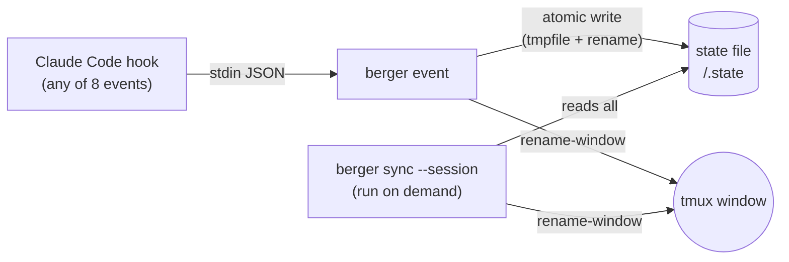

# berger

Make tmux sessions agent-aware from Claude Code lifecycle hooks.

Claude Code hooks call `berger event`, which writes a state file and renames the
current tmux window to show the agent's status as a suffix — no background
process involved.

```
1:main  2:plan  3:impl!  4:review✓  5:tests✗
```

## Symbols

| State    | Symbol | Meaning                |
|----------|--------|------------------------|
| working  | _(none)_ | Busy, no action needed |
| approval | `!`    | Needs your input        |
| done     | `✓`    | Session finished        |
| error    | `✗`    | Hook / tool error       |

## Quick start

```bash
cargo install --path . --root ~/.local
berger init
```

`init` wires everything up:

- Rewrites `~/.claude/settings.json` so all 8 lifecycle hooks call `berger event`,
  leaving unrelated hooks untouched. Re-running `init` is idempotent.
- Writes `~/.config/berger/tmux.conf` (berger's own settings — `allow-rename off`,
  `automatic-rename off`, and a `prefix + M` binding that runs `berger sync`).
  Prints the one line to add to your `~/.tmux.conf`:

  ```tmux
  source-file ~/.config/berger/tmux.conf
  ```

- Creates the state cache root.

Then name your tmux windows to match agent roles:

```bash
tmux rename-window impl
tmux rename-window plan
```

When Claude Code runs in one of these windows, the suffix updates as hooks fire.

## Event → state mapping

| Event | State | Symbol |
|---|---|---|
| `SessionStart` | `working` | _(none)_ |
| `UserPromptSubmit` | `working` | _(none)_ |
| `PreToolUse` | `working` | _(none)_ |
| `PermissionRequest` | `approval` | `!` |
| `PostToolUseFailure` | `error` | `✗` |
| `Stop` | `done` | `✓` |
| `StopFailure` | `error` | `✗` |
| `SessionEnd` | _(state file deleted)_ | _(suffix cleared)_ |

`berger event` never exits non-zero — it sits on Claude Code's hook path, where a
failing exit code can block a tool call or prompt, so a berger bug must never be
able to interfere with your session. Errors go to stderr; the event is a no-op.

Running outside tmux (a plain terminal, an IDE, CI) is a normal condition, not an
error — `event` returns without doing anything tmux-related.

## Manual usage

```bash
# Reconcile every window in a session against its state files — useful if a
# rename was missed or a window name drifted. Bound to prefix + M by init.
berger sync --session myproject

# Clear all runtime state (berger's own cache, plus any leftover amux cache)
berger reset
```

There is no `watch`/daemon: state only changes when a hook fires, so `event`
renames the window in the same invocation. `sync` is the on-demand repair path
for anything that falls out of sync in between.

## Testing

Unit tests live alongside the Rust source (`cargo test`). The smoke suite in
`tests/smoke_test.py` drives a real, throwaway tmux server end-to-end —
build the binary first, then run it:

```bash
cargo build
python3 tests/smoke_test.py          # run everything
python3 tests/smoke_test.py -v       # verbose

# run a single test
python3 tests/smoke_test.py SmokeLifecycle.test_permission_request_adds_bang

# opt-in: also exercise a real `claude` session through the installed hooks
BERGER_TEST_REAL_CLAUDE=1 python3 tests/smoke_test.py
```

Each test spins up an isolated `tmux -L berger-test-<pid>-<n>` server with its
own `HOME`/`XDG_CACHE_HOME` and a `tmux` PATH shim — your real tmux server and
config are never touched. See `tests/harness/sandbox.py` for details.

## Per-window agent name

Agent name is resolved from the current tmux window name (suffix stripped), or
`$BERGER_AGENT` if set, or `basename $PWD` as a last resort:

```bash
export BERGER_AGENT=impl
claude
```

## File locations

| What | Path |
|---|---|
| Binary | `~/.local/bin/berger` |
| tmux config | `~/.config/berger/tmux.conf` (sourced from your `~/.tmux.conf`) |
| Claude Code hooks | `~/.claude/settings.json` |
| State files | `$XDG_CACHE_HOME/berger/<session>/<agent>.state` (default `~/.cache/berger/...`) |

## Architecture



`berger event` is short-lived: read stdin, write state, exit — nothing stays running
between hooks. `berger sync` reads every state file for a session and reconciles any
window that has drifted; run it manually, or bind it to a tmux key (`init` does this
by default).

State files are plain key=value text — no JSON, no jq required.

## Troubleshooting

- **Window names not updating**: check that `allow-rename off` and
  `automatic-rename off` are set (via `~/.config/berger/tmux.conf`, sourced from
  your `~/.tmux.conf`).
- **A name looks stale**: run `berger sync --session <name>` to reconcile.
- **State files**: `ls $XDG_CACHE_HOME/berger/<session>/` (default
  `~/.cache/berger/<session>/`).

## Migrating from amux

Superseded by berger; the original bash prototype is kept in `legacy/` for
reference. If an `amux watch` process is still running from before, `berger
init` will warn and print the command to kill it — a live watcher would
otherwise keep fighting berger's renames.
